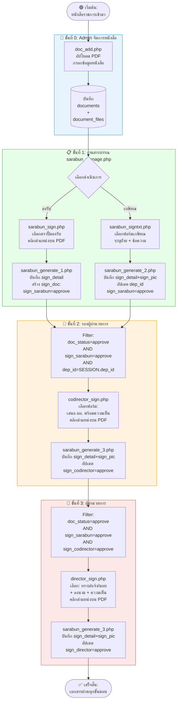
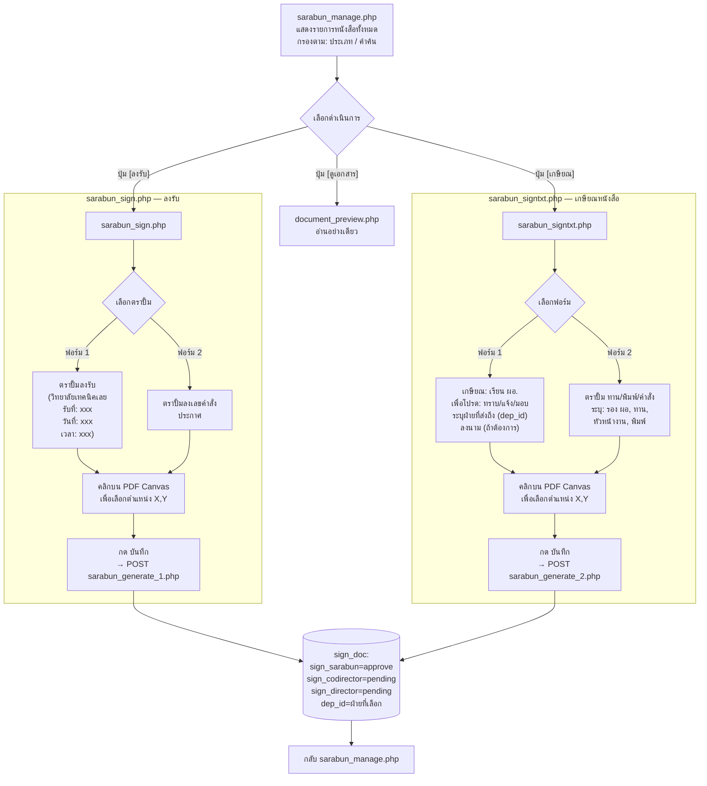
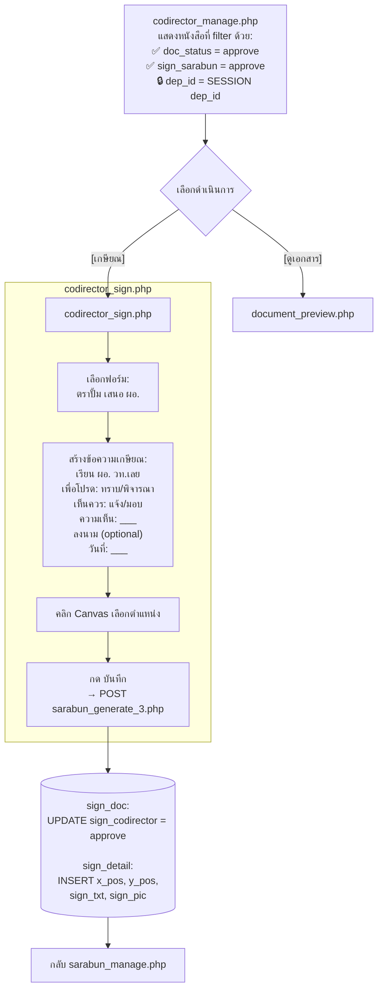
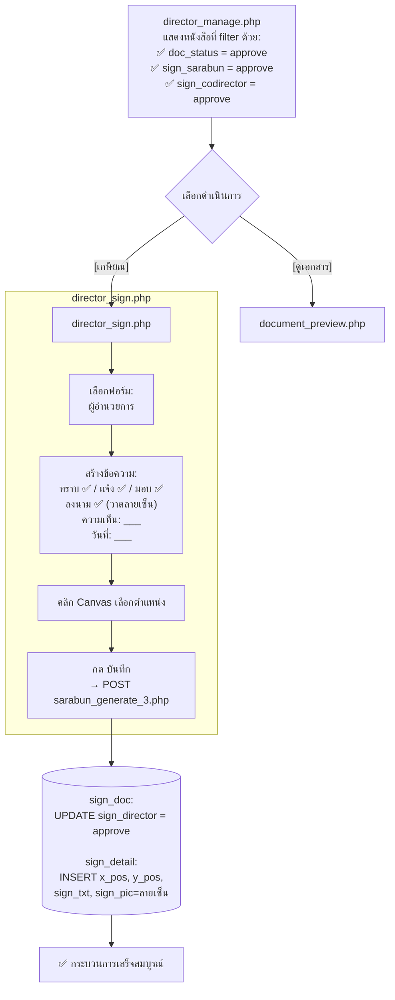
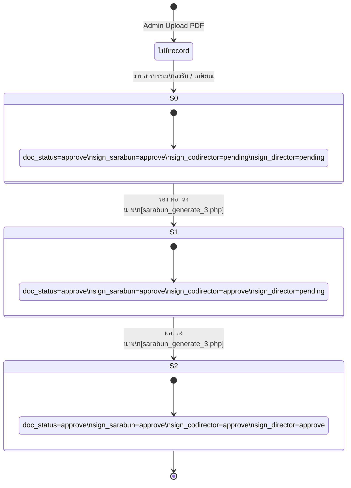
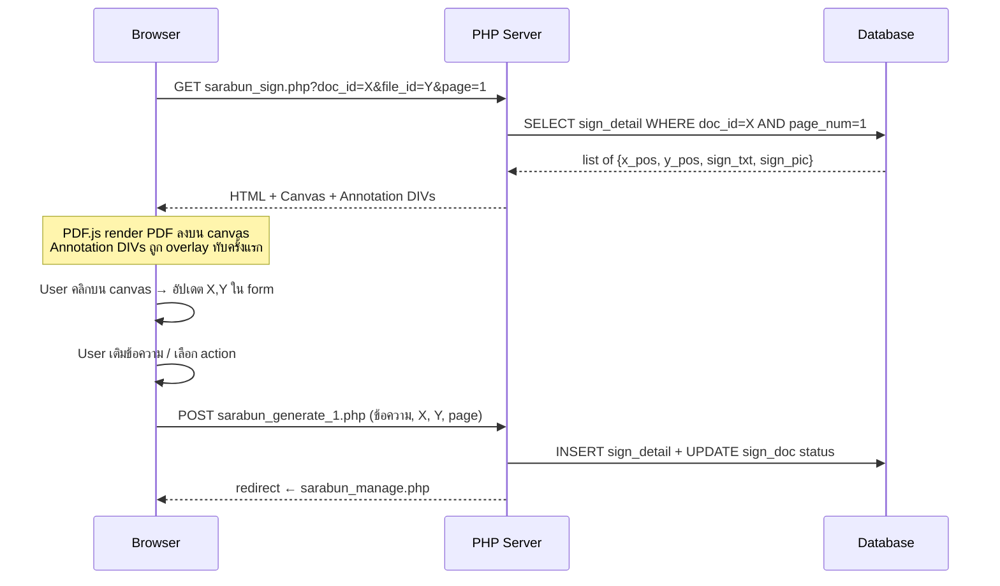
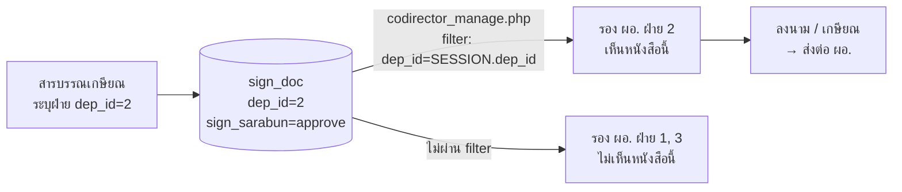

# 🖊️ LoeiTech E-Sign System – วิเคราะห์ Workflow การลงนาม

> **ระบบลงนามเอกสารอิเล็กทรอนิกส์** วิทยาลัยเทคนิคเลย
> ไฟล์นี้วิเคราะห์จากโค้ดจริงทุกไฟล์ + ฐานข้อมูล

---

## 1. ภาพรวม Workflow การลงนาม

ระบบมีขั้นตอนการลงนามทั้งหมด **3 ขั้นตอน** ตามลำดับชั้นองค์กร:

```
หนังสือเข้า → [งานสารบรรณ] → [รองผู้อำนวยการ (ตามฝ่าย)] → [ผู้อำนวยการ] → จบ
```

สถานะใน `sign_doc` ที่ควบคุม workflow นี้:

| Field | เริ่มต้น | หลังสารบรรณ | หลังรอง ผอ. | หลัง ผอ. |
|---|---|---|---|---|
| `doc_status` | - | `approve` | `approve` | `approve` |
| `sign_sarabun` | `pending` | **`approve`** | `approve` | `approve` |
| `sign_codirector` | `pending` | `pending` | **`approve`** | `approve` |
| `sign_director` | `pending` | `pending` | `pending` | **`approve`** |

---

## 2. ฐานข้อมูลที่เกี่ยวข้องกับ Workflow

### ตาราง `sign_doc` (หัวใจของ Workflow)

```sql
CREATE TABLE sign_doc (
    sign_doc_id    INT AUTO_INCREMENT PRIMARY KEY,
    doc_id         INT,               -- FK → documents.doc_id
    user_id        INT,               -- ผู้เริ่มต้น workflow
    dep_id         INT,               -- ฝ่ายที่หนังสือนี้ส่งถึง (รอง ผอ. เห็นเฉพาะ dep_id ตัวเอง)
    doc_status     VARCHAR(50),       -- 'approve' = ผ่าน Admin
    sign_sarabun   VARCHAR(50),       -- 'pending' | 'approve'
    sign_codirector VARCHAR(50),      -- 'pending' | 'approve'
    sign_director  VARCHAR(50)        -- 'pending' | 'approve'
);
```

### ตาราง `sign_detail` (เก็บ annotation บน PDF)

```sql
CREATE TABLE sign_detail (
    detail_id      INT AUTO_INCREMENT PRIMARY KEY,
    sign_doc_id    INT,               -- FK → sign_doc.sign_doc_id
    sign_file_id   INT,               -- FK → document_files.file_id
    page_num       INT,               -- หน้าที่ลงนาม
    x_pos          FLOAT,             -- พิกัด X บน Canvas (px)
    y_pos          FLOAT,             -- พิกัด Y บน Canvas (px)
    sign_txt       TEXT,              -- ข้อความที่แสดงบน PDF
    sign_pic       VARCHAR(255),      -- path ลายเซ็นรูปภาพ (NULL ถ้าไม่มี)
    sign_by        INT,               -- FK → user.user_id ผู้ลงนาม
    sign_datetime  DATETIME           -- วันเวลาที่ลงนาม
);
```

---

## 3. Workflow Flow Chart โดยละเอียด

### 3.1 ภาพรวม End-to-End



---

### 3.2 ขั้นที่ 1 – งานสารบรรณ (รายละเอียด)



---

### 3.3 ขั้นที่ 2 – รองผู้อำนวยการ (รายละเอียด)



---

### 3.4 ขั้นที่ 3 – ผู้อำนวยการ (รายละเอียด)



---

## 4. State Machine ของ sign_doc



---

## 5. วิธีที่ระบบแสดง Annotation บน PDF

ทุกหน้าการลงนามใช้ **PDF.js** render ไฟล์ PDF ลงบน `<canvas>` และเมื่อ load หน้า จะดึง `sign_detail` ที่บันทึกไว้มาแสดงทับบน canvas อีกครั้ง:



---

## 6. การ Route หนังสือถึงรอง ผอ. แต่ละฝ่าย

> 🔑 **Key discovery**: ระบบใช้ `dep_id` ใน `sign_doc` เพื่อกำหนดว่าหนังสือนี้ "เสนอ" ถึงรอง ผอ. ฝ่ายใด



---

## 7. ไฟล์และหน้าที่ในระบบ Workflow

| ไฟล์ | บทบาท | Input | Output |
|---|---|---|---|
| `sarabun_manage.php` | แสดงรายการหนังสือทั้งหมด | Filter GET | ตาราง + ปุ่ม action |
| `sarabun_sign.php` | UI ลงรับ (ตราปั้ม) | doc_id, file_id, page | Form + PDF Canvas |
| `sarabun_signtxt.php` | UI เกษียณ (ข้อความ+ลายเซ็น) | doc_id, file_id, page | Form + PDF Canvas |
| `sarabun_generate_1.php` | บันทึกตราปั้มลงรับ | POST form | INSERT sign_doc, sign_detail |
| `sarabun_generate_2.php` | บันทึกเกษียณ (สารบรรณ) | POST form | INSERT/UPDATE sign_doc, sign_detail |
| `codirector_manage.php` | รายการสำหรับรอง ผอ. | dep_id filter | ตาราง + ปุ่ม action |
| `codirector_sign.php` | UI ลงนามรอง ผอ. | doc_id, file_id, page | Form + PDF Canvas |
| `director_manage.php` | รายการสำหรับ ผอ. | sign_codirector=approve | ตาราง + ปุ่ม action |
| `director_sign.php` | UI ลงนาม ผอ. | doc_id, file_id, page | Form + PDF Canvas |
| `sarabun_generate_3.php` | บันทึก annotation รอง ผอ./ผอ. | POST form | UPDATE sign_codirector หรือ sign_director |
| `document_preview.php` | Preview PDF + Annotation (อ่านอย่างเดียว) | doc_id, file_id, page | PDF Canvas + Annotation |

---

## 8. ปัญหาที่พบจากการวิเคราะห์ Workflow

### 🔴 Bug ที่อาจเกิดขึ้น

| ปัญหา | ไฟล์ | สาเหตุ |
|---|---|---|
| รอง ผอ. ทุกฝ่ายเห็นหนังสือได้ถ้าไม่ได้ระบุ dep_id | `sarabun_generate_1.php` | ลงรับ (ฟอร์ม 1) ไม่บันทึก dep_id ใน sign_doc |
| sarabun_generate_3.php ใช้ร่วมกันทั้ง รอง ผอ. และ ผอ. | ทั้งคู่ | Logic ต่างกันแต่ใช้ไฟล์เดียวกัน อาจสับสน |
| ผอ. เห็นเอกสารที่รอง ผอ. ยังไม่ลงนาม | `director_manage.php` | Filter ถูกต้องแล้ว แต่ถ้า sign_codirector skip ได้ผ่าน |
| ลงนามซ้ำได้ (ไม่มีการ lock หลัง approve) | sign_detail | ไม่มีการตรวจสอบว่า sign แล้วหรือยัง |

### 🟡 จุดที่ควรปรับปรุง

| รายการ | เหตุผล |
|---|---|
| ปุ่ม "ลงรับ" ถูก disable เมื่อ `doc_status=approve` แต่ logic ใน PHP ไม่ตรงกัน | ปุ่มยัง active ถ้าไม่มี record ใน sign_doc |
| ไม่มีการแจ้งเตือนเมื่อหนังสือถูกส่งถึงฝ่าย | รอง ผอ.ต้อง refresh หน้าเองตลอด |
| `sarabun_generate_3.php` redirect กลับ sarabun_manage.php เสมอ | ควร redirect กลับหน้าที่เหมาะสมตาม role |

---

## 9. แผนพัฒนา Workflow ต่อ

### ✅ ด่วน: แก้ Bug
- [ ] `sarabun_generate_1.php` ต้องบันทึก `dep_id` ใน `sign_doc` เมื่อสารบรรณเลือกฝ่ายปลายทาง
- [ ] แยก generate script ของ รอง ผอ. และ ผอ. ออกจากกัน

### 🔧 ปรับปรุง Workflow
- [ ] เพิ่ม `status` badge บน Dashboard แสดงจำนวนหนังสือรอดำเนินการ
- [ ] เพิ่มการ lock annotation หลัง approve แล้ว (ป้องกันการแก้ไข)
- [ ] เพิ่ม history timeline ของแต่ละ document (join sign_detail กับ user)
- [ ] Email/Notification เมื่อหนังสือถูกส่งมาถึงฝ่ายตัวเอง

### 🚀 ใหม่
- [ ] สร้าง PDF จริง (embed annotation ลงในไฟล์ PDF ถาวร) ด้วย mPDF แทนการ overlay CSS
- [ ] QR Code ตรวจสอบสถานะ workflow บนเอกสาร

---

*วิเคราะห์จากโค้ดจริงทุกไฟล์ ณ วันที่ 25 กุมภาพันธ์ 2569*
