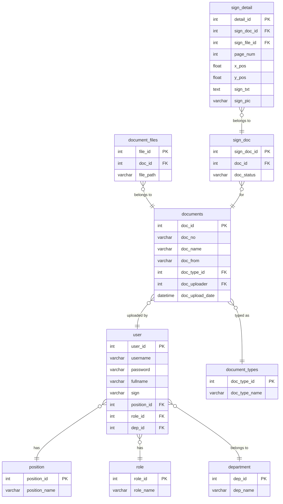
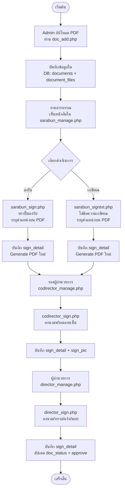
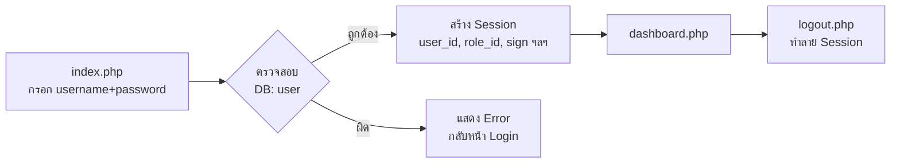

# 📋 edoc67 – วิเคราะห์โปรเจคและแผนพัฒนาต่อยอด
> **LoeiTech E-sign System** — ระบบงานสารบรรณและลงนามเอกสารอิเล็กทรอนิกส์ วิทยาลัยเทคนิคเลย

---

## 1. ภาพรวมของระบบ (Project Overview)

ระบบ E-sign นี้เป็นเว็บแอปพลิเคชันที่พัฒนาด้วย **PHP + MariaDB** รันบน **Docker** มีฟังก์ชันหลักคือ:
- **บริหารจัดการหนังสือราชการ** (รับ, ส่ง, จัดเก็บ PDF)
- **ลงนาม / เกษียณหนังสือ บนไฟล์ PDF** ด้วยการคลิกบนหน้าเอกสาร (pdf.js)
- **ระบบผู้ใช้งาน** แบบ Role-based (งานสารบรรณ, รองผู้อำนวยการ, ผู้อำนวยการ)

---

## 2. Stack เทคโนโลยี (Tech Stack)

| Layer | Technology |
|---|---|
| Backend | PHP 8.1 |
| Frontend | HTML5, Bootstrap 5, PDF.js v2.5 |
| Database | MariaDB (MySQL) |
| PDF Processing | mPDF 8.1.3 |
| Container | Docker + docker-compose |
| DB Admin | phpMyAdmin |
| Font | Google Fonts – Sarabun |

---

## 3. โครงสร้างโฟลเดอร์ (File Structure)

```
edoc67/
├── 📄 index.php              # หน้า Login
├── 📄 dashboard.php          # หน้าแรกหลัง Login
├── 📄 logout.php             # ออกจากระบบ
│
├── 📄 edoc-db.php            # Database Connection + Helper Functions
├── 📄 base.php               # Layout หลัก (Header, Sidebar, Footer)
├── 📄 base_sidebarmenu.php   # เมนู Sidebar
├── 📄 base_user_status.php   # แสดงสถานะผู้ใช้
│
├── ── USER MANAGEMENT ──
├── 📄 user_manage.php        # CRUD ผู้ใช้งาน
│
├── ── DOCUMENT MANAGEMENT ──
├── 📄 doc_manage.php         # จัดการหนังสือ (Admin)
├── 📄 doc_add.php            # เพิ่มหนังสือพร้อม upload PDF
├── 📄 doc_edit.php           # แก้ไขหนังสือ
├── 📄 doc_delete.php         # ลบหนังสือ
├── 📄 doc_delete_file.php    # ลบไฟล์แนบ
│
├── ── SARABUN WORKFLOW ──
├── 📄 sarabun_manage.php     # งานสารบรรณ – ดูรายการ + ลงรับ/เกษียณ
├── 📄 sarabun_sign.php       # ลงรับ / ตราปั้ม (สารบรรณ)
├── 📄 sarabun_signtxt.php    # เกษียณหนังสือโดยสารบรรณ
├── 📄 sarabun_doc_detail.php # รายละเอียดหนังสือ
│
├── ── CO-DIRECTOR WORKFLOW ──
├── 📄 codirector_manage.php  # รายการสำหรับรอง ผอ.
├── 📄 codirector_sign.php    # ลงนามโดยรอง ผอ.
│
├── ── DIRECTOR WORKFLOW ──
├── 📄 director_manage.php    # รายการสำหรับ ผอ.
├── 📄 director_sign.php      # ลงนามโดย ผอ.
│
├── ── PREVIEW ──
├── 📄 document_preview.php   # แสดงตัวอย่าง PDF พร้อม Annotation
│
├── ── PDF GENERATION ──
├── 📄 sarabun_generate_1.php # generate ตราปั้มลงรับ
├── 📄 sarabun_generate_2.php # generate ตราปั้มประเภท 2
├── 📄 sarabun_generate_3.php # generate annotation ผอ. ลงบน PDF
├── 📄 generate_pdf1.php      # generate PDF via mPDF
│
├── ── SETTINGS ──
├── 📄 setting_department.php # CRUD แผนก
├── 📄 setting_doc_type.php   # CRUD ประเภทหนังสือ
├── 📄 setting_position.php   # CRUD ตำแหน่ง
│
├── ── INFRASTRUCTURE ──
├── 📄 Dockerfile             # PHP 8.1 + Apache image
├── 📄 docker-compose.yml     # App + MariaDB + phpMyAdmin
├── 📄 .env                   # Environment variables
├── 📄 composer.json          # Dependencies (mPDF)
├── 📁 uploads/               # ไฟล์ที่ Upload (PDF, ลายเซ็น)
├── 📁 assets/                # Bootstrap, CSS, JS
├── 📁 fonts/                 # ฟอนต์ภาษาไทย
└── 📁 vendor/                # Composer dependencies
```

---

## 4. โครงสร้างฐานข้อมูล (Database Schema)

> **Database:** `e-sign`



---

## 5. แผนผังการทำงานของระบบ (Workflow)

### 5.1 กระบวนการหนังสือราชการ (Document Flow)



### 5.2 Authentication Flow



---

## 6. บัญชีผู้ใช้และสิทธิ์ (Roles)

| Role | หน้าที่ | หน้าหลัก |
|---|---|---|
| **Admin** | จัดการผู้ใช้, หนังสือ, ตั้งค่า | `user_manage.php`, `doc_manage.php` |
| **งานสารบรรณ** | ลงรับ, เกษียณหนังสือ | `sarabun_manage.php` |
| **รองผู้อำนวยการ** | ลงนาม/ความเห็น | `codirector_manage.php` |
| **ผู้อำนวยการ** | อนุมัติ/ลงนามขั้นสุดท้าย | `director_manage.php` |

> ⚠️ **ปัจจุบัน**: ระบบยังไม่มีการ Check role_id เพื่อจำกัดการเข้าถึงหน้าแต่ละหน้าอย่างชัดเจน (เบื้องหลัง check แค่ session)

---

## 7. ปัญหาที่พบและข้อแนะนำ (Issues Found)

### 🔴 ปัญหาด้านความปลอดภัย (Security)

| ปัญหา | ไฟล์ที่เกี่ยวข้อง | แนวทางแก้ไข |
|---|---|---|
| ใช้ `md5()` สำหรับ Hash password | `index.php`, `user_manage.php` | เปลี่ยนเป็น `password_hash()` + `password_verify()` |
| SQL Injection ใน `doc_manage.php` | `doc_manage.php`, `sarabun_manage.php` | ใช้ Prepared Statement ทุกที่ |
| ไม่มี Role-based Access Control | ทุกหน้า | ตรวจสอบ `$_SESSION['role_id']` ก่อน render |
| ชื่อไฟล์ Upload ไม่ sanitize | `user_manage.php` | Rename ไฟล์ด้วย `uniqid()` + ตรวจ MIME type |
| ไม่มี CSRF Token | ทุก Form POST | เพิ่ม CSRF token ใน form |

### 🟡 ปัญหาด้านโค้ด (Code Quality)

| ปัญหา | รายละเอียด |
|---|---|
| Duplicate Code | `sarabun_sign.php`, `codirector_sign.php`, `director_sign.php` มีโค้ด PDF render ซ้ำกัน |
| ไม่มี Error Handling | กรณี DB ล้มเหลว ไม่แสดง error message ที่เหมาะสม |
| sidebar link ซ้ำ | `base_sidebarmenu.php` มีลิงก์ที่ชี้ไปหน้าเดิม |
| ไม่มีฐานข้อมูลเริ่มต้น | ไม่มีไฟล์ `.sql` สำหรับ import schema |

---

## 8. แผนพัฒนาต่อยอด (Development Roadmap)

### ✅ Phase 1: แก้ไขพื้นฐาน (พร้อมใช้งาน) — 1-2 สัปดาห์

- [ ] สร้างไฟล์ `database/schema.sql` — โครงสร้างตารางและข้อมูลเริ่มต้น (role, position)
- [ ] เปลี่ยน MD5 → `password_hash()` ใน login และ user management
- [ ] แก้ SQL injection ใน `doc_manage.php`, `sarabun_manage.php` ให้ใช้ Prepared Statement
- [ ] เพิ่ม Role-based access check ทุกหน้า (ตรวจสอบ role_id จาก session)
- [ ] ปรับ Dockerfile ให้ install composer dependencies อัตโนมัติ

### 🔧 Phase 2: ปรับปรุงฟีเจอร์ — 2-4 สัปดาห์

- [ ] **Dashboard ที่สมบูรณ์**: แสดงสถิติ เช่น จำนวนหนังสือทั้งหมด, รอดำเนินการ, อนุมัติแล้ว
- [ ] **Refactor PDF Signing**: รวมโค้ด `sarabun_sign.php`, `codirector_sign.php`, `director_sign.php` เป็น component เดียว
- [ ] **ระบบแจ้งเตือน (Notification)**: แจ้งเตือนเมื่อมีหนังสือรอลงนาม (Badge ใน sidebar หรือ Email)
- [ ] **ระบบค้นหาขั้นสูง**: กรองตามวันที่, ผู้ส่ง, สถานะ, ประเภทหนังสือ
- [ ] **Pagination ที่ถูกต้อง**: แก้ Bug pagination parameter ให้ครบใน URL
- [ ] **Upload ไฟล์หลายไฟล์พร้อมกัน**: UI drag-and-drop และ progress bar

### 🚀 Phase 3: ยกระดับระบบ — 1-2 เดือน

- [ ] **Audit Log**: บันทึกทุก action ว่าใคร ทำอะไร เวลาไหน (ตาราง `activity_log`)
- [ ] **ประวัติการลงนาม (Sign History)**: แสดง Timeline การดำเนินการของแต่ละเอกสาร
- [ ] **ระบบรายงาน**: Export รายงานหนังสือเป็น Excel หรือ PDF สรุป
- [ ] **QR Code**: สร้าง QR Code บนเอกสารเพื่อตรวจสอบความถูกต้อง
- [ ] **Email Integration**: ส่ง Email แจ้งเตือนเมื่อเอกสารถูกโอนสาย
- [ ] **API Layer**: RESTful API สำหรับรองรับ Mobile App ในอนาคต

### 🔒 Phase 4: Production Hardening

- [ ] HTTPS / SSL Certificate (ถ้า deploy บน server)
- [ ] Nginx reverse proxy แทน Apache โดยตรง
- [ ] Database backup scheduled task
- [ ] Docker health check และ restart policy
- [ ] Rate Limiting บน login endpoint

---

## 9. ขั้นตอนเริ่มต้นพัฒนา (Quick Start for Developer)

### 9.1 Setup โครงการ

```bash
# 1. Clone หรือ copy โฟลเดอร์
cd edoc67

# 2. ตรวจสอบ .env
cat .env
# MYSQL_HOST=db
# MYSQL_ROOT_PASSWORD=toor
# MYSQL_DATABASE=e-sign
# MYSQL_USER=esign
# MYSQL_PASSWORD=esignpwd

# 3. Build และ Start containers
docker-compose up -d --build

# 4. Import Database Schema (เมื่อมีไฟล์ sql)
docker exec -i mariadb_edoc mysql -u esign -pesignpwd e-sign < database/schema.sql
```

### 9.2 เข้าใช้งาน

| URL | ระบบ |
|---|---|
| http://localhost:8080 | Application หลัก |
| http://localhost:8081 | phpMyAdmin (จัดการ DB) |

### 9.3 สร้าง Database Schema เริ่มต้น

ต้องสร้างตารางเหล่านี้ใน phpMyAdmin หรือสร้างไฟล์ `schema.sql`:

```sql
CREATE TABLE `role` (role_id INT AUTO_INCREMENT PRIMARY KEY, role_name VARCHAR(100));
CREATE TABLE `position` (position_id INT AUTO_INCREMENT PRIMARY KEY, position_name VARCHAR(100));
CREATE TABLE `department` (dep_id INT AUTO_INCREMENT PRIMARY KEY, dep_name VARCHAR(100));
CREATE TABLE `user` (
    user_id INT AUTO_INCREMENT PRIMARY KEY,
    username VARCHAR(100) UNIQUE,
    password VARCHAR(255),
    fullname VARCHAR(255),
    sign VARCHAR(255),
    position_id INT, role_id INT, dep_id INT
);
CREATE TABLE `document_types` (doc_type_id INT AUTO_INCREMENT PRIMARY KEY, doc_type_name VARCHAR(100));
CREATE TABLE `documents` (
    doc_id INT AUTO_INCREMENT PRIMARY KEY,
    doc_no VARCHAR(100), doc_name TEXT, doc_from VARCHAR(255),
    doc_type_id INT, doc_uploader INT, doc_upload_date DATETIME DEFAULT NOW()
);
CREATE TABLE `document_files` (file_id INT AUTO_INCREMENT PRIMARY KEY, doc_id INT, file_path VARCHAR(255));
CREATE TABLE `sign_doc` (sign_doc_id INT AUTO_INCREMENT PRIMARY KEY, doc_id INT, doc_status VARCHAR(50));
CREATE TABLE `sign_detail` (
    detail_id INT AUTO_INCREMENT PRIMARY KEY,
    sign_doc_id INT, sign_file_id INT, page_num INT,
    x_pos FLOAT, y_pos FLOAT, sign_txt TEXT, sign_pic VARCHAR(255)
);
-- Seed data
INSERT INTO `role` VALUES (1,'Admin'),(2,'สารบรรณ'),(3,'รองผู้อำนวยการ'),(4,'ผู้อำนวยการ');
INSERT INTO `position` VALUES (1,'ครู');
INSERT INTO `department` VALUES (1,'ฝ่ายบริหาร');
-- Default admin user (password: admin123)
INSERT INTO `user` VALUES (1,'admin',MD5('admin123'),'ผู้ดูแลระบบ',NULL,1,1,1);
```

---

## 10. สิ่งที่ต้องทำก่อนใช้งาน Production

> [!CAUTION]
> ห้ามนำระบบขึ้น Production ก่อนแก้ไขสิ่งเหล่านี้:
> 1. **เปลี่ยน MD5 → bcrypt** (`password_hash` / `password_verify`)
> 2. **แก้ SQL Injection** ใน `doc_manage.php` และ `sarabun_manage.php`
> 3. **เพิ่ม Role Check** ทุกหน้า PHP
> 4. **เปลี่ยน Default Password** ใน `.env`
> 5. **ไม่ commit `.env`** ขึ้น Git

---

*วิเคราะห์ ณ วันที่ 25 กุมภาพันธ์ 2569*
